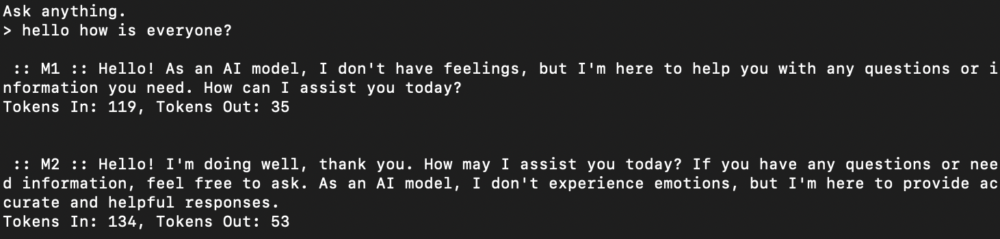
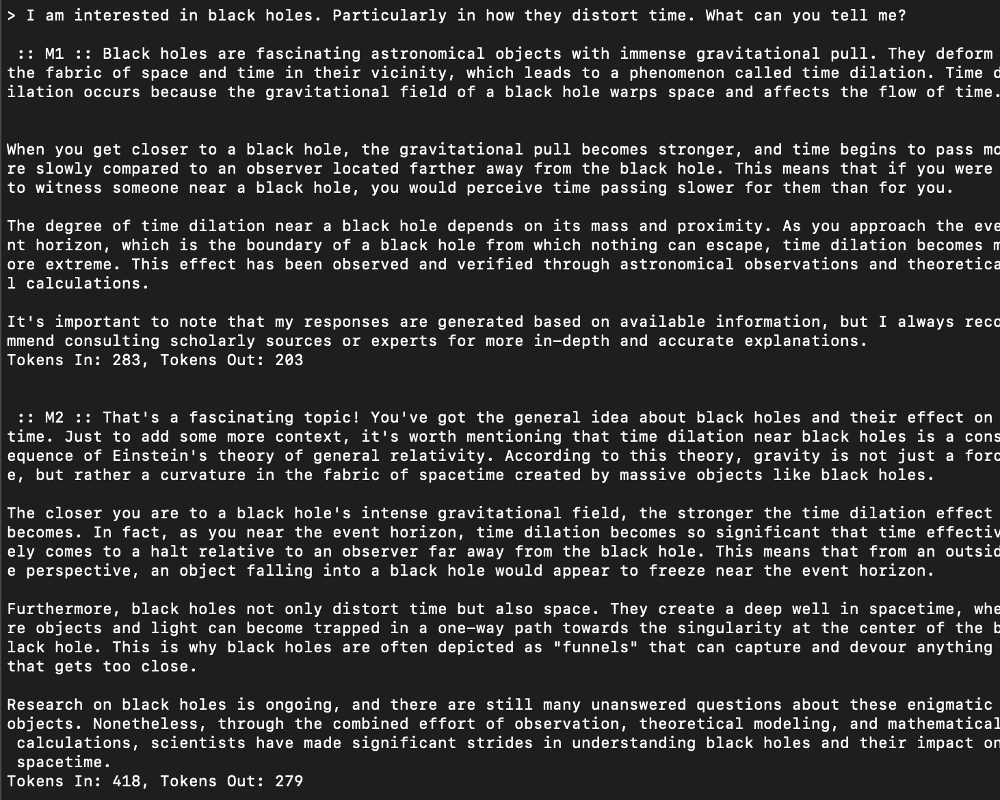

[](https://github.com/psf/black)
[](https://github.com/psf/black/blob/main/LICENSE)

# dualGPT

```
      _             _  ____ ____ _____ 
   __| |_   _  __ _| |/ ___|  _ \_   _|
  / _` | | | |/ _` | | |  _| |_) || |  
 | (_| | |_| | (_| | | |_| |  __/ | |  
  \__,_|\__,_|\__,_|_|\____|_|    |_|  
                                       
``` 
##### Why talk to one instance of ChatGPT when you could talk to two.

## <sub> What is it?

* Another command line tool for the [OpenAI API - Docs](https://platform.openai.com/docs/introduction).
* You are in a conversation with two instances of ChatGPT. One will attempt to follow up or correct the information given by the other model.
* This is not useful in any way, I wanted to see if I could talk to two of them at a time :).


## <sub> dualGPT


* Talk to "gpt-3.5-turbo" model by default.
* Utilize ChatGPT like you would in the browser.
* Pass in -m "<MODEL_NAME>" to use an alternative model.
  * See the [OpenAI models overview](https://platform.openai.com/docs/models/overview).



## <sub> How to install.

* Install the latest version of [Python 3](https://www.python.org/downloads).
* Install the OpenAI [Python package](https://pypi.org/project/openai).
* Clone the repo.

## <sub> How to use.

* Add your OpenAI API key to <b>config.ini</b>.
* python3 dualGPT.py
  * Run default application.
* python3 dualGPT.py -h
  * Display help message.
* python3 dualGPT.py -m "gpt-4"
  * Use model "gpt-4".
